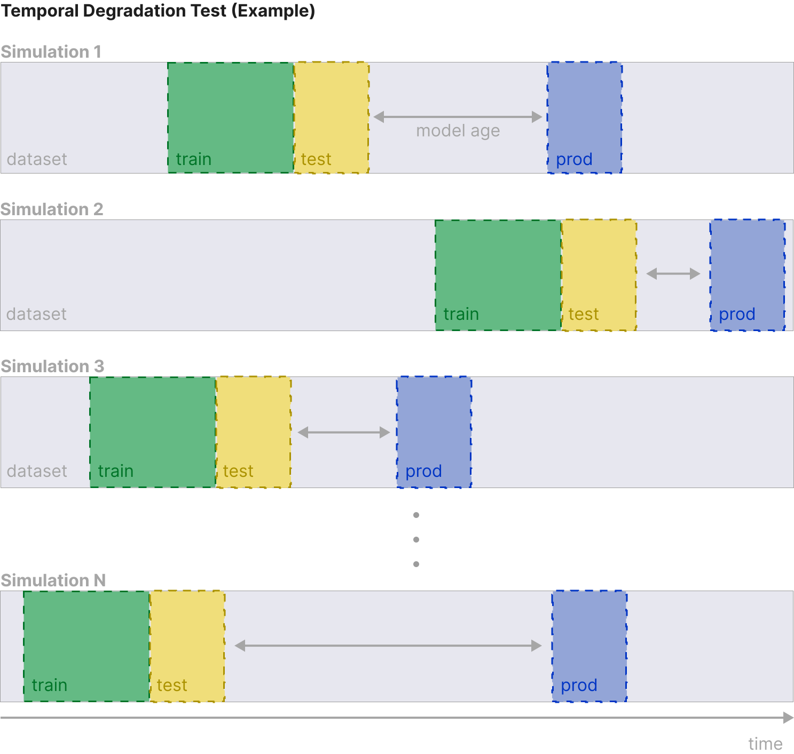
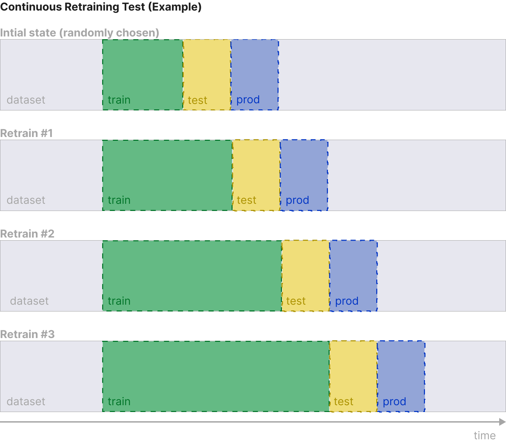
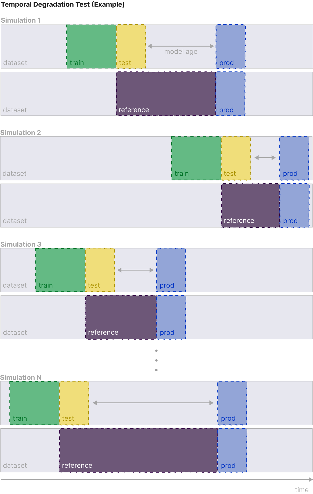

# ageML

ageML is the early beginning of a framework to assess the temporal predictive performance degradation of machine learning models.

Disclamer, this project is still very unmature so, code is not the cleanest. Some things might be hardcoded, but the idea is to make it better
and usable by other people so they can use it to explore performance degradation patterns on other datasets, under any machine learning technique.
With the goal to facilitate the exploration of performance degradation in machine learning models.

 

## What does it do?
This project implements three tests to study the "aging" process that machine learning models can experienced when in production due to covariate shift.

The currently, the implemented test are:

### Temporal Degradation Test
Examines how various models perform when trained on different samples of the same dataset. This framework is based on the aging framework developed by [Vela et al.](https://www.nature.com/articles/s41598-022-15245-z) in 2022.

 

### Continuous Retraining Test
Simulates a fixed-schedule retraining process of a machine learning model in production.

 

### Performance Estimation Test
Explores the potential of performance estimation methods to identify predictive performance degradation without ground truth data. Currently, uses NannyML's Direct Loss Estimation (DLE) method for this.

 

## Author

- [santiviquez](https://www.twitter.com/santiviquez)

